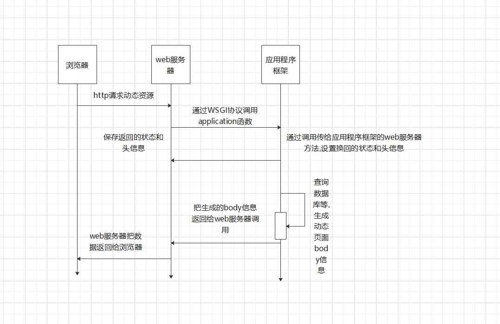

### 1.WSGI

**1.定义:**Python Web Server Gateway Interface

2.**作用:**实现web框架和服务器的混合使用

3.**常见的web服务器:**NGIN+UWSGI/GUNICERN

**4.怎样定义WSGI接口:**

```python
#由WSGI服务器来调用
def application(environ, start_response):
    start_response('200 OK', [('Content-Type', 'text/html')])
    return 'Hello World!
```

| 参数           | 描述                               |
| -------------- | ---------------------------------- |
| environ        | 一个包含所有HTTP请求信息的dict对象 |
| start_response | 一个发送HTTP响应的函数             |

**5.web服务器-----WSGI协议---->web框架 传递的字典environ:**



```python
{
    'HTTP_ACCEPT_LANGUAGE': 'zh-cn',
    'wsgi.file_wrapper': <built-infunctionuwsgi_sendfile>,
    'HTTP_UPGRADE_INSECURE_REQUESTS': '1',
    'uwsgi.version': b'2.0.15',
    'REMOTE_ADDR': '172.16.7.1',
    'wsgi.errors': <_io.TextIOWrappername=2mode='w'encoding='UTF-8'>,
    'wsgi.version': (1,0),
    'REMOTE_PORT': '40432',
    'REQUEST_URI': '/',
    'SERVER_PORT': '8000',
    'wsgi.multithread': False,
    'HTTP_ACCEPT': 'text/html,application/xhtml+xml,application/xml;q=0.9,*/*;q=0.8',
    'HTTP_HOST': '172.16.7.152: 8000',
    'wsgi.run_once': False,
    'wsgi.input': <uwsgi._Inputobjectat0x7f7faecdc9c0>,
    'SERVER_PROTOCOL': 'HTTP/1.1',
    'REQUEST_METHOD': 'GET',
    'HTTP_ACCEPT_ENCODING': 'gzip,deflate',
    'HTTP_CONNECTION': 'keep-alive',
    'uwsgi.node': b'ubuntu',
    'HTTP_DNT': '1',
    'UWSGI_ROUTER': 'http',
    'SCRIPT_NAME': '',
    'wsgi.multiprocess': False,
    'QUERY_STRING': '',
    'PATH_INFO': '/index.html',
    'wsgi.url_scheme': 'http',
    'HTTP_USER_AGENT': 'Mozilla/5.0(Macintosh;IntelMacOSX10_12_5)AppleWebKit/603.2.4(KHTML,likeGecko)Version/10.1.1Safari/603.2.4',
    'SERVER_NAME': 'ubuntu'
}
```

```python
#新建框架包 dynamic
#添加static 和template
#移除html,修改静态文件的路径
```

```python
# 替换{ content }内容
# 动态添加接口
# 添加mini_frame:application
# 添加web服务器器的配置文件 configparse
# 使用shell脚本进行执行
# readme.txt的使用
```

```python
#带有参数的装饰器

```

